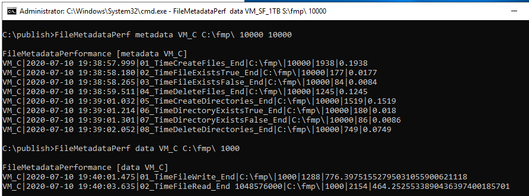
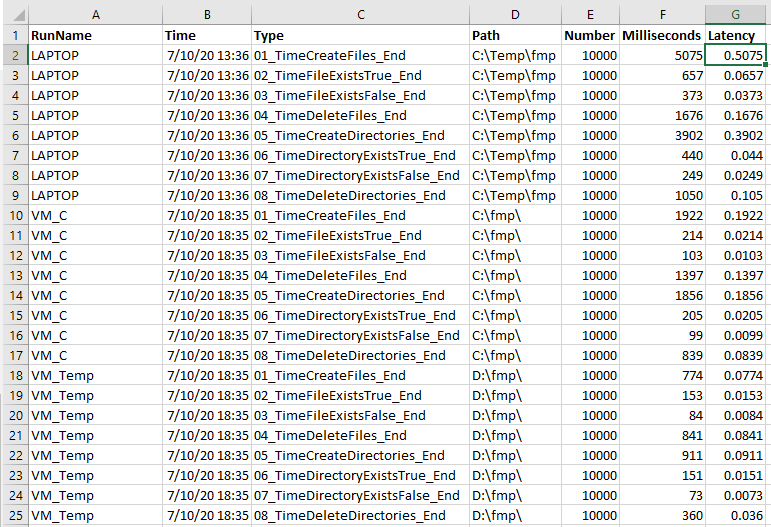
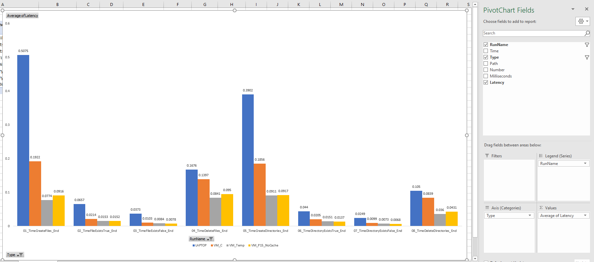

# FileMetadataPerf .NET Core C# app

Simple .NET Core C# console application for timing sequential file/directory metadata operations (i.e. create, exists, delete, etc.) and sequential text file write/read.

Example command lines for metadata timing

```cmd
FileMetadataPerf.exe metadata VM_C C:\fmp\ 10000 10000

FileMetadataPerf.exe metadata VM_Temp D:\fmp\ 10000 10000

FileMetadataPerf.exe metadata VM_P15_NoCache E:\fmp\ 10000 10000

FileMetadataPerf.exe metadata VM_P15_ReadCache E:\fmp\ 10000 10000

FileMetadataPerf.exe metadata VM_SF_1TB S:\fmp\ 1000 1000

FileMetadataPerf.exe metadata VM_PF_1TB P:\fmp\ 1000 1000

FileMetadataPerf.exe metadata VM_PF_10TB Q:\fmp\ 1000 1000
```

Example command lines for data timing

```cmd

FileMetadataPerf.exe data VM_C C:\fmp\ 10000

FileMetadataPerf.exe data VM_Temp D:\fmp\ 10000

FileMetadataPerf.exe data VM_P15_ReadCache E:\fmp\ 10000

FileMetadataPerf.exe data VM_P15_NoCache E:\fmp\ 10000

FileMetadataPerf.exe data VM_SF_1TB S:\fmp\ 10000

FileMetadataPerf.exe data VM_PF_1TB P:\fmp\ 10000

FileMetadataPerf.exe data VM_PF_10TB Q:\fmp\ 10000
```

Screenshot of output



Data is copy-able to Excel



For simple Excel Pivot Chart/Table analysis


